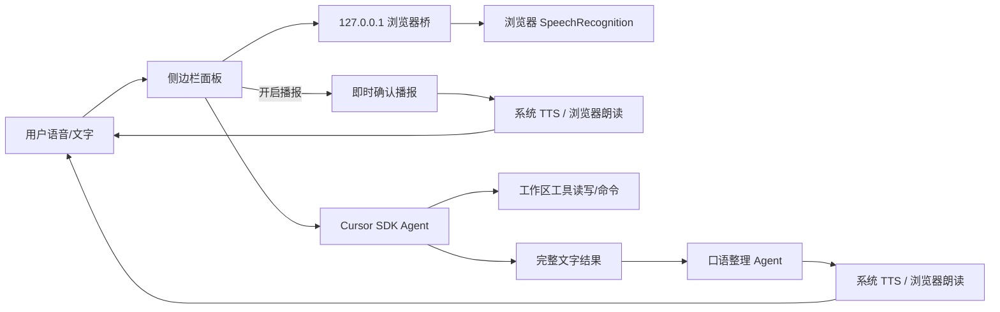

# AI 语音聊天（Cursor 扩展）

[](https://github.com/IsaWinding/aivoicechat)
[](https://www.npmjs.com/package/@cursor/sdk)
[](https://nodejs.org/)

在 Cursor 侧边栏用**语音或文字**下达任务。扩展通过 Cursor SDK 在本机对当前工作区启动 Agent，并把进度以文字和语音回流到同一面板。

**仓库：** https://github.com/IsaWinding/aivoicechat

## 快速开始

1. 克隆仓库并编译：`git clone https://github.com/IsaWinding/aivoicechat.git && cd aivoicechat && npm install && npm run compile`
2. 在 Cursor 中按 `F5` 启动扩展，或执行 `npm run package` 生成 VSIX 后安装
3. 在设置里填入 [Cursor API Key](https://cursor.com/dashboard/integrations)（或设置环境变量 `CURSOR_API_KEY`）
4. 打开工作区，按 `Ctrl+Alt+V` 打开面板，点击麦克风并在浏览器中允许麦克风

## 目录

- [功能概览](#功能概览)
- [架构简述](#架构简述)
- [准备](#准备)
- [安装与调试](#安装与调试)
- [配置](#配置)
- [用法](#用法)
- [命令与快捷键](#命令与快捷键)
- [语音说明](#语音说明)
- [语音交互流程](#语音交互流程)
- [平台兼容](#平台兼容)
- [对话体验](#对话体验)
- [常见问题](#常见问题)
- [开发与测试](#开发与测试)
- [项目结构](#项目结构)
- [版本记录](#版本记录)
- [注意](#注意)
- [相关文档](#相关文档)

## 功能概览

- 侧边栏文字 / 语音输入，本机 Cursor Agent 执行任务
- 浏览器麦克风桥（解决 Webview 无法授权麦克风的问题）
- Windows 系统 TTS 播报；其他平台走浏览器或面板朗读
- **即时确认播报**：收到问题后先口头确认「已开始处理」，任务完成后再播报结论
- 独立口语模型整理长回答，结合上下文挑重点播报；**不朗读命令、代码块和工具过程**
- 插话打断、连续补充合并、停止 / 新会话 / 取消任务

## 架构简述



- **任务 Agent**：读写文件、跑命令，输出完整 Markdown 文字
- **口语 Agent**：只读上下文，禁用工具，把长结果压缩成 60–220 字口语
- **浏览器桥**：仅监听 `127.0.0.1`，随机令牌鉴权，SSE 推送状态

## 准备

- Cursor / VS Code（扩展宿主 Node.js ≥ 22.13）
- [Cursor API Key](https://cursor.com/dashboard/integrations)
- 已打开一个工作区文件夹

## 安装与调试

```bash
git clone https://github.com/IsaWinding/aivoicechat.git
cd aivoicechat
npm install
npm run compile
```

然后任选一种方式：

1. **F5 调试**：用 Cursor 打开本仓库，按 `F5` 启动扩展开发宿主。
2. **安装 VSIX**：`npm run package`（或 `npx @vscode/vsce package --allow-missing-repository`），再在 Cursor 里「从 VSIX 安装…」。

打开侧边栏「AI 语音聊天」，或命令面板搜索「打开 AI 语音聊天」。

## 配置

在设置中搜索 `aivoicechat`，或在 `.vscode/settings.json` 中配置（可参考 `.vscode/settings.example.json`）：

| 项 | 默认值 | 说明 |
| --- | --- | --- |
| `aivoicechat.apiKey` | `""` | Cursor API Key。也可设环境变量 `CURSOR_API_KEY` |
| `aivoicechat.model` | `composer-2.5` | 本机 Agent 使用的模型 ID |
| `aivoicechat.language` | `zh-CN` | 语音识别与播报语言，如 `zh-CN`、`en-US` |
| `aivoicechat.speechInput` | `browser` | 语音输入：`browser`（推荐，系统浏览器识别）或 `webview`（多数环境不可用） |
| `aivoicechat.speechOutput` | `auto` | 语音播报：`auto` / `system` / `browser` / `webview` |
| `aivoicechat.autoSpeak` | `true` | 是否自动播报任务进度和结论 |

## 用法

- 在输入框打字，`Enter` 发送，`Shift+Enter` 换行
- 点击「语音」开始识别，再点一次停止；识别结果可改后再发送
- 按住麦克风（触摸或按住 Shift 再按鼠标）说话，松手后自动发送
- 任务进行中可点「取消」
- 「播报开/关」控制是否朗读进度
- 「新会话」会结束当前 Agent 并清空对话

状态栏右侧的「语音聊天」可快速打开面板并切换麦克风。

## 命令与快捷键

| 命令 | 快捷键 | 说明 |
| --- | --- | --- |
| 打开 AI 语音聊天 | `Ctrl+Alt+V`（Mac：`Cmd+Alt+V`） | 打开对话面板 |
| 开始/停止语音输入 | — | 打开面板并切换麦克风 |
| 新会话 | — | 结束当前 Agent 并清空对话 |
| 取消当前任务 | — | 停止进行中的 Agent |
| 试播语音（测试扬声器） | — | 测试 TTS 是否正常 |

## 语音说明

Cursor / VS Code 的 Webview 不允许访问麦克风（无法弹出授权），因此语音输入默认走**浏览器桥**：点击麦克风或光球时，扩展在本机 `127.0.0.1` 起一个带随机令牌的小服务，并用系统浏览器打开识别页。浏览器会正常弹出「允许使用麦克风」，允许后直接说话，说完停顿约 1.2 秒后自动发送；插话会停止播报、取消旧回答，再结合会话上下文回答最新内容；Cursor 的进度和结论也会同步显示在该页面。

- 推荐用 Edge 打开（国内网络下 Chrome 的语音服务可能连不上）
- 页面保持打开即可反复说话；关闭页面后再点麦克风会重新打开
- 如需改回面板内识别，把 `aivoicechat.speechInput` 设为 `webview`（多数环境不可用）

**语音播报**由 `aivoicechat.speechOutput` 控制，默认 `auto`：

- Windows 上使用系统语音引擎（System.Speech，选择已安装的中文音色），不受浏览器「需先点击才可播放」策略限制；朗读期间浏览器页保持识别，开口可打断；建议戴耳机，避免外放回声误触发
- 其他系统使用浏览器页朗读（页面需被点击过一次），无浏览器页时在 Cursor 面板内朗读
- 完整结果先显示为文字，再由独立模型调用组织口语回答：结合最新问题、近期对话、完整结果、重要异常和最近六次口语记录挑重点，避免重复背景。代码、命令和详情留在文字中，工具过程不逐条朗读
- 口语通常为一到四句话，目标 60–160 字，最多 220 字。口语整理使用同一 Cursor 模型，但禁用全部工具，不会执行文件或命令操作，也不把内部整理提示写入任务会话
- 开启播报时每轮增加一次模型调用，带来额外费用与等待；实测三个样例约 3–10 秒。超过 15 秒或生成失败时提示查看文字，不把截断的片段当作完整总结。关闭播报则不发起这次调用，也不会播报即时确认
- 插话、停止、新会话和关闭播报会使待生成的旧口语失效。口语历史记录的是「已请求播放／被打断」，不代表精确知道用户听到了哪个字

云端 Whisper / Azure / 阿里接口已预留在 `src/voice/`，第一版未接通。

## 语音交互流程

一次完整语音对话通常分三个阶段：

| 阶段 | 时机 | 播报内容 | 说明 |
| --- | --- | --- | --- |
| **即时确认** | 发送问题后立刻 | 「好的，收到。我现在开始处理，完成后告诉你结果。」 | 固定短句，无需额外模型；面板进度区同步显示「已确认：…」 |
| **任务执行** | Agent 运行期间 | 一般不播报 | 工具调用过程只显示文字进度，不逐条朗读 |
| **结论播报** | 任务完成后 | 口语整理后的摘要 | 独立模型压缩长回答；失败/未验证等关键信息会保留 |

关闭「播报」或 `aivoicechat.autoSpeak = false` 时，三个阶段均不发声，也不发起口语整理模型调用。

## 平台兼容

| 能力 | Windows | macOS / Linux |
| --- | --- | --- |
| 语音输入（浏览器桥） | ✅ 推荐 Edge | ✅ 推荐 Chrome / Edge |
| 系统 TTS 播报 | ✅ System.Speech | ❌ 需用浏览器或面板朗读 |
| 即时确认 + 结论播报 | ✅ | ✅（需先点击浏览器页） |
| 插话打断 | ✅ | ✅ |
| 本机 Agent 执行 | ✅ | ✅ |

国内网络下语音识别优先使用 **Edge**；Chrome 可能无法连接 Google 语音服务。

## 对话体验

- 输入框支持 Shift+Enter 换行，中文输入法选字时不会误发送
- 文字消息也能打断旧回答；连续补充会合并后接续
- 开启播报时，发送问题后会**先听到确认**，任务结束后再听到结论；插话会取消待播的旧结论，但已播的确认不会回退
- 停止按钮同时停止语音和当前任务；新会话清理待发送内容。取消不能撤销已经完成的文件或命令操作
- 语音使用浏览器 SpeechRecognition 和系统 TTS，并非端到端实时语音模型。识别延迟、外放回声和音色取决于浏览器、网络及设备

## 常见问题

### 麦克风打不开或识别失败

- Cursor 面板内 Webview **无法**弹出麦克风授权，请保持 `aivoicechat.speechInput` 为 `browser`
- 国内网络优先用 **Edge**；Chrome 可能报「语音服务网络连接失败」
- 浏览器页需点击「允许麦克风」；关闭页后再次点麦克风会重新打开
- 防火墙勿拦截本机 `127.0.0.1` 临时端口

### 有文字但没有声音

- Windows 确认已安装中文语音包；可运行命令「试播语音（测试扬声器）」
- 非 Windows 需先**点击浏览器识别页**一次，才能播放 TTS
- 检查 `aivoicechat.autoSpeak` 是否为 `true`，面板或浏览器页「播报」是否开启
- 若能看到文字进度但听不到「好的，收到…」，多半是播报被关或 TTS 未就绪；结论整理超时（15 秒）时会提示看文字，属正常降级

### Agent 无响应或报错

- 确认已打开**工作区文件夹**（不是单文件）
- 检查 API Key：设置 `aivoicechat.apiKey` 或环境变量 `CURSOR_API_KEY`
- Node.js 版本需 ≥ 22.13（Cursor 扩展宿主要求）
- 任务进度只在本扩展面板显示，不会出现在 Cursor 内置聊天窗口

### API Key 配置示例

```json
{
  "aivoicechat.apiKey": "你的 Cursor API Key",
  "aivoicechat.model": "composer-2.5",
  "aivoicechat.language": "zh-CN",
  "aivoicechat.autoSpeak": true
}
```

也可在终端启动 Cursor 前设置环境变量：

```bash
# Windows PowerShell
$env:CURSOR_API_KEY = "你的 Key"

# macOS / Linux
export CURSOR_API_KEY="你的 Key"
```

## 开发与测试

| 脚本 | 说明 |
| --- | --- |
| `npm run compile` | 编译 TypeScript 到 `out/` |
| `npm run watch` | 监听文件变更并自动编译 |
| `npm run package` | 打包 VSIX |
| `npm test` | 本地回归测试（28 项：HTTP 桥、对话逻辑、即时确认、口语整理等） |
| `npm run test:smoke` | 冒烟测试 |
| `npm run test:live` | 真实 Cursor 模型对话测试（需 `CURSOR_API_KEY`） |
| `npm run test:spoken` | 真实模型口语整理三场景测试，结果写入 `out/live-spoken-results.json` |

真实模型测试需通过进程环境提供 `CURSOR_API_KEY`。

## 项目结构

```
aivoicechat/
├── src/                 # 扩展主逻辑
│   ├── extension.ts     # 入口、命令注册
│   ├── chatPanel.ts     # 侧边栏 Webview 面板
│   ├── agentSession.ts  # Cursor SDK Agent 会话
│   ├── micBridge.ts     # 浏览器麦克风本地桥
│   ├── progress.ts      # 进度文案、即时确认、口语预处理
│   ├── spokenReply.ts   # 口语整理与播报
│   └── voice/           # 云端语音接口预留
├── media/               # Webview 静态资源（CSS/JS/图标/识别页）
├── scripts/             # 测试与 live 脚本
├── docs/                # 测试报告与说明
└── esbuild.mjs          # 构建配置
```

## 版本记录

| 版本 | 说明 |
| --- | --- |
| **0.5.1+** | 任务开始时即时语音确认；口语播报过滤命令/代码块；打断逻辑与口语历史记录优化；28 项本地测试 |
| **0.5.1** | 浏览器麦克风桥；Windows 系统 TTS；独立口语整理 Agent；插话打断与连续补充；真实模型口语测试 |

## 注意

- SDK 跑的是独立 Agent，不会出现在你正在看的那条 Cursor 聊天里，进度以本面板为准
- 本地 Agent 会按默认策略自动执行读文件、改文件、跑命令等工具，请只在可信工作区使用

## 相关文档

- [语音聊天测试与体验对比](docs/voice-test-report.md) — 口语整理、插话打断、真实模型测试记录

---

**English (brief):** A Cursor/VS Code extension for voice and text chat with a local Cursor Agent. Speech input uses a localhost browser bridge (Webview cannot access the mic). When auto-speak is on, the extension first speaks an immediate acknowledgment, then summarizes the final result via a separate tool-free Agent call (commands and code blocks are not read aloud). Requires Cursor API Key and Node.js ≥ 22.13. Windows uses system TTS; other platforms use browser or panel speech.
